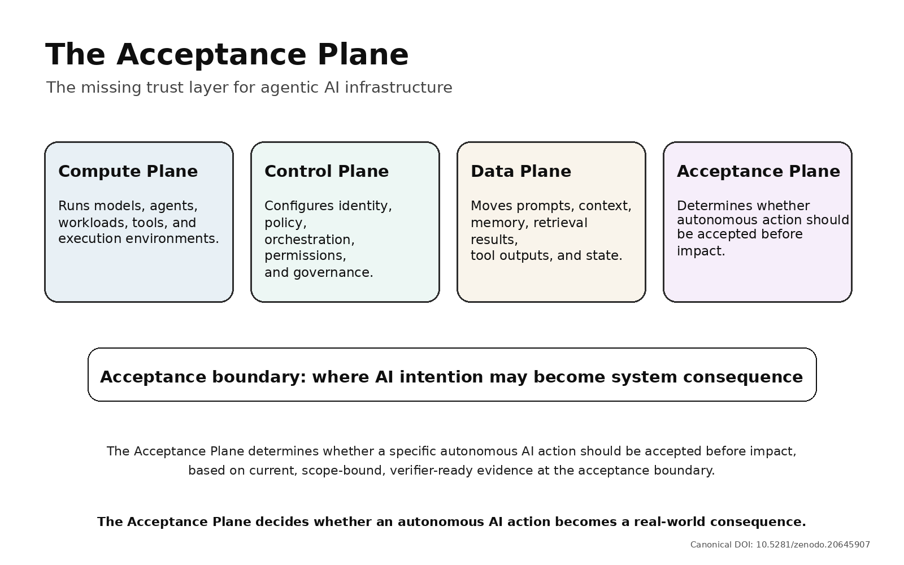
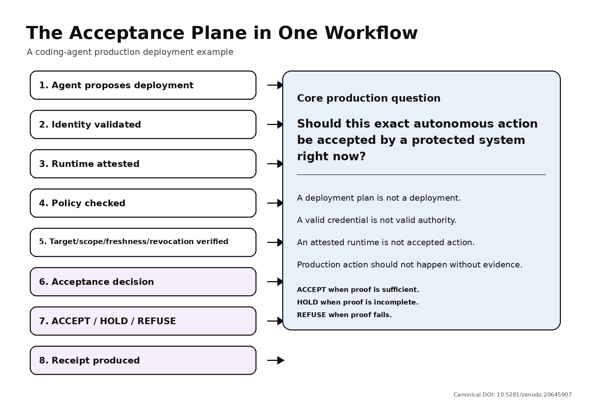

# The Acceptance Plane

## The Missing Trust Layer for Agentic AI Infrastructure

**Public Architecture Thesis v1.0.0**  
**Meridian Verity Group**  
**Author:** Scott Lee  
**Release date:** 2026-06-11  
**Canonical DOI:** https://doi.org/10.5281/zenodo.20645907

> **Status:** This release is a public architecture thesis. It is not a formal standard, product specification, legal opinion, compliance certification, patent claim chart, or implementation disclosure.

## Recommended Citation

> Lee, Scott. Meridian Verity Group. (2026). The Acceptance Plane: The Missing Trust Layer for Agentic AI Infrastructure (v1.0.0). Zenodo. https://doi.org/10.5281/zenodo.20645907

---

## Abstract

Agentic AI shifts the trust question from output correctness to action acceptance. As AI agents invoke tools, call APIs, update systems, reuse context, trigger workflows, and affect protected environments, identity, access control, attestation, policy checks, encryption, and logs remain necessary. They are not always sufficient, however, to determine whether a specific autonomous action should be accepted before impact.

This technical note introduces **the Acceptance Plane**: an architectural function for determining whether a specific autonomous AI action should be accepted by a protected system based on current, scope-bound, verifier-ready evidence at the acceptance boundary.

The paper defines the Acceptance Plane, explains why protected execution is not the same as accepted action, and illustrates the concept through a production deployment workflow: agent proposal, identity validation, runtime attestation, policy check, target/scope/freshness/revocation verification, acceptance decision, and verifier-ready receipt.

The purpose of this release is to provide a public, citable architecture thesis for action-level trust in agentic AI infrastructure.

---

## 1. Canonical Definition

**The Acceptance Plane is an architectural function that determines whether a specific autonomous AI action should be accepted by a protected system before impact, based on current, scope-bound, verifier-ready evidence at the acceptance boundary.**

Short form:

> **The Acceptance Plane decides whether an autonomous AI action becomes a real-world consequence.**

Category frame:

- **Compute Plane:** runs models, agents, workloads, tools, and execution environments.
- **Control Plane:** configures identity, policy, orchestration, permissions, and governance.
- **Data Plane:** moves prompts, context, memory, retrieval results, tool outputs, and state.
- **Acceptance Plane:** determines whether autonomous action should be allowed to affect protected systems.

This is not a replacement for identity, access control, policy, attestation, or logging. It is the architectural function that binds those signals to a specific action at the point where the action may become real.



---

## 2. Why the Boundary Has Moved

For advisory AI, the core trust question was often:

> **Did the model produce the right output?**

For operational AI, the harder question is:

> **Should this exact action be accepted into a protected system right now?**

That is a different question. A model can generate a useful deployment plan, but the production deployment is a separate event. A workload can be authenticated, but its authority may be stale. An environment can be attested, but the resulting action may still be outside current scope. A policy may have been checked earlier, but the target, approval state, revocation state, or risk context may have changed before impact.

The failure point is not always model reasoning. Often, the failure point is protected system acceptance.

---

## 3. Necessary Controls Are Not the Same as Action Acceptance

Identity and workload authentication help answer who or what is acting.

Confidential computing and remote attestation can provide evidence about where execution occurred and what was measured.

Policy engines help express, evaluate, and update rules.

Encryption protects communication and data movement.

Logs help reconstruct what happened after the fact.

All of these controls matter. None of them, by itself, always proves that a specific autonomous action should be accepted before it affects a protected system.

The Acceptance Plane asks a narrower and harder question:

> **Is this action, under this current authority, scope, policy state, runtime evidence, target, and freshness condition, acceptable now?**

Access gets an agent to the door. Acceptance decides whether the action enters production.

---

## 4. Gate-Time Evidence

High-consequence actions need evidence at the gate, not only logs after impact or broad permissions established earlier.

For a protected action, gate-time evidence may include:

- the action being attempted;
- the agent, workload, user delegation, or service initiating it;
- the runtime or environment evidence relevant to the action;
- the approved scope and target;
- the current policy state;
- freshness, revocation, and replay indicators;
- the required approval, step-up, or hold condition;
- the final acceptance decision and reason.

This list is intentionally high-level. It is a public category description, not an evidence schema, enforcement pipeline, cryptographic protocol, product design, or patent claim map.

---

## 5. The Acceptance Plane in One Workflow

A simplified coding-agent deployment workflow illustrates the category:

```text
AI agent proposes deployment
-> identity validated
-> runtime attested
-> policy checked
-> target, scope, freshness, and revocation verified
-> acceptance decision
-> ACCEPT / HOLD / REFUSE
-> verifier-ready receipt
```

At each step, the system gathers or evaluates evidence. The important moment is the acceptance boundary: the point where a proposed AI action may become a production consequence.

A deployment plan is not a deployment.

A valid credential is not valid authority.

An attested runtime is not accepted action.

The protected system still needs to decide whether the deployment action should be accepted now.



---

## 6. ACCEPT, HOLD, or REFUSE

The Acceptance Plane does not need to make every workflow slow. It needs to make the decision explicit and fail-closed for high-consequence actions.

**ACCEPT** means the evidence is current, scoped, consistent, and sufficient.

**HOLD** means the evidence is incomplete, stale, ambiguous, high-risk, or requires step-up review.

**REFUSE** means the action is outside authority, mismatched, revoked, replayed, unverifiable, unsafe, or not bound to the intended target.

The operating principle is simple:

> **Fail-closed autonomy: accept when proof is sufficient, hold when proof is incomplete, and refuse when proof fails.**

---

## 7. Verifier-Ready Receipts

When an autonomous action is accepted, held, or refused, the system should produce more than a vague log entry.

A verifier-ready receipt should provide enough structure to understand:

- what action was attempted;
- what authority and scope were evaluated;
- what evidence and policy state were checked;
- what decision was made;
- why the action was accepted, held, or refused.

The receipt concept matters because agentic AI accountability cannot begin only after harm. In high-consequence environments, accountability has to begin at the point of action.

---

## 8. What This Is - and What It Is Not

The Acceptance Plane is a public architecture category for discussing action-level trust in agentic AI infrastructure.

It is not a claim that identity, access control, attestation, confidential computing, policy engines, encryption, or logs are unnecessary. They remain necessary inputs.

It is not a formal standard, product specification, API contract, compliance certification, legal opinion, patent claim chart, or implementation disclosure.

It is not a promise that every AI action requires the same depth of review. Low-risk actions may need lightweight controls. High-consequence actions need stronger proof before impact.

The purpose of the category is to name the missing architectural function: deciding whether a specific autonomous action should become real.

---

## 9. Infrastructure Placement

The acceptance boundary may appear in different places depending on system design and risk: agent runtime, gateway, policy layer, application boundary, data layer, or deeper infrastructure boundary.

The exact placement will vary.

The function should not.

Wherever autonomous AI action crosses from intention into consequence, a protected system should be able to ask whether the action is acceptable now and answer with evidence.

---

## 10. Publication Discipline

The public thesis should be simple:

> **Publish the category. Protect the mechanism.**

Public materials should define the Acceptance Plane, explain the workflow, introduce the vocabulary, and provide conceptual diagrams.

Private materials should retain implementation-level details such as exact API schemas, full evidence object models, cryptographic binding methods, enforcement pipelines, hardware-specific claim maps, partner-specific deployments, and unpublished patent claim language.

This discipline supports public category creation while reducing unnecessary implementation disclosure.

---

## 11. Closing

The next trust layer for agentic AI infrastructure is not only explainability, access control, attestation, policy, encryption, or logging.

It is accountable action before impact.

Access is not authority. Permission is not proof. Execution is not acceptance. And production action should not happen without evidence.

The Acceptance Plane is one way to name the architectural function that decides whether AI action becomes real.
